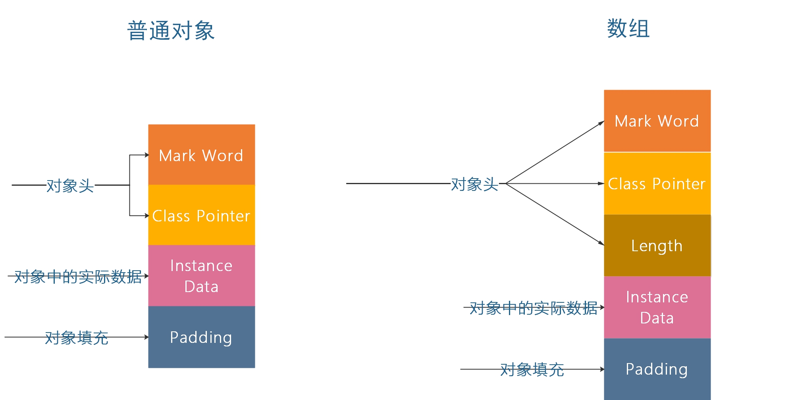
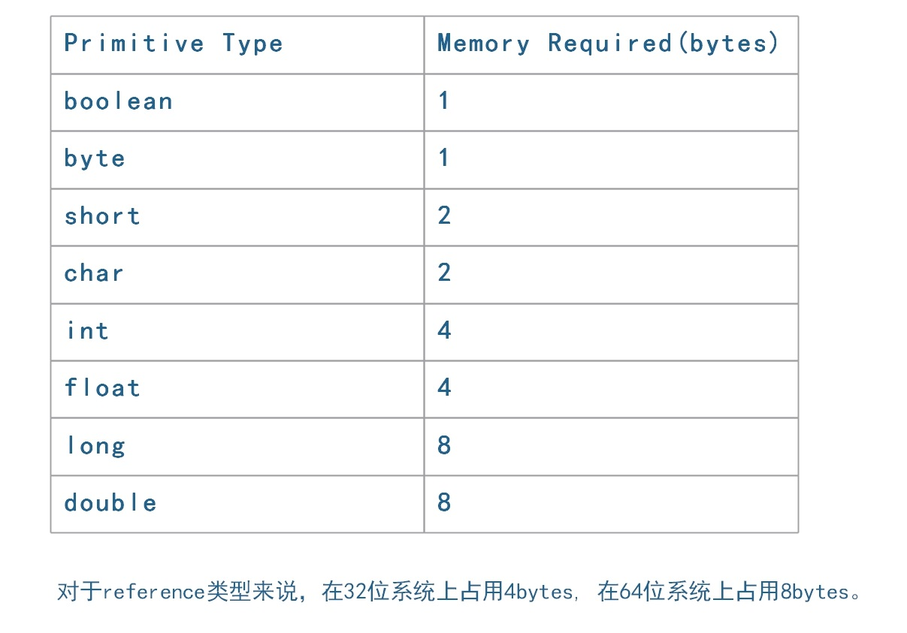
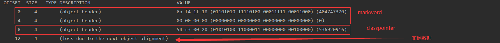

#### 加锁后
通过对象在内存中的布局，判断对象是否持有锁。
#### 对象内存布局

##### 对象头
    Mark Word：包含一系列的标记位，比如轻量级锁的标记位，偏向锁标记位等等。在32位系统占4字节，在64位系统中占8字节；
    Class Pointer：用来指向对象对应的Class对象（其对应的元数据对象）的内存地址。在32位系统占4字节，在64位系统中占8字节；
    Length：如果是数组对象，还有一个保存数组长度的空间，占4个字节；
##### 对象实际数据
    对象实际数据包括了对象的所有成员变量，其大小由各个成员变量的大小决定，比如：byte和boolean是1个字节，
    short和char是2个字节，int和float是4个字节，long和double是8个字节，reference是4个字节（64位系统中是8个字节）。
    
##### 对齐填充
    Java对象占用空间是8字节对齐的，即所有Java对象占用bytes数必须是8的倍数。例如，一个包含两个属性的对象：int和byte，这个对象需要占用8+4+1=13个字节，这时就需要加上大小为3字节的padding进行8字节对齐，最终占用大小为16个字节。

注意：以上对64位操作系统的描述是未开启指针压缩的情况.
  

##### 指针压缩
     从上文的分析中可以看到，64位JVM消耗的内存会比32位的要多大约1.5倍，这是因为对象指针在64位JVM下有更宽的寻址。对于那些将要从32位平台移植到64位的应用来说，平白无辜多了1/2的内存占用，这是开发者不愿意看到的。
     从JDK 1.6 update14开始，64位的JVM正式支持了 -XX:+UseCompressedOops 这个可以压缩指针，起到节约内存占用的新参数。
     
##### 对象占用空间大小
     32位系统和64位系统中对象所占用内存空间的大小：
     在32位系统下，存放Class Pointer的空间大小是4字节，MarkWord是4字节，对象头为8字节;
     在64位系统下，存放Class Pointer的空间大小是8字节，MarkWord是8字节，对象头为16字节;
     64位开启指针压缩的情况下，存放Class Pointer的空间大小是4字节，MarkWord是8字节，对象头为12字节;
     如果是数组对象，对象头的大小为：数组对象头8字节+数组长度4字节+对齐4字节=16字节。其中对象引用占4字节（未开启指针压缩的64位为8字节），数组MarkWord为4字节（64位未开启指针压缩的为8字节）;
     静态属性不算在对象大小内。
     
#### 对象内存布局举例    
