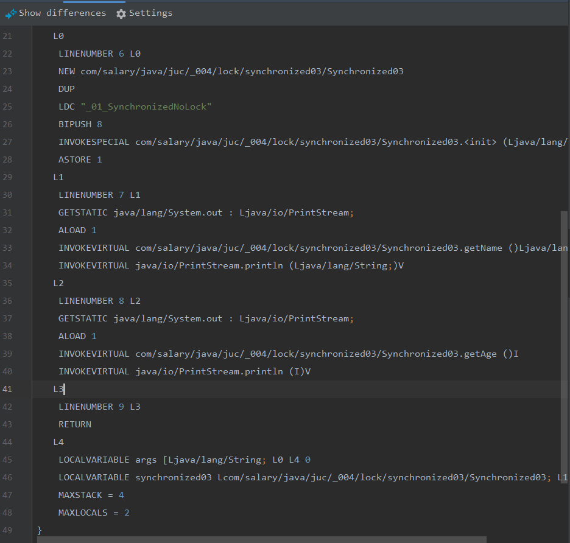
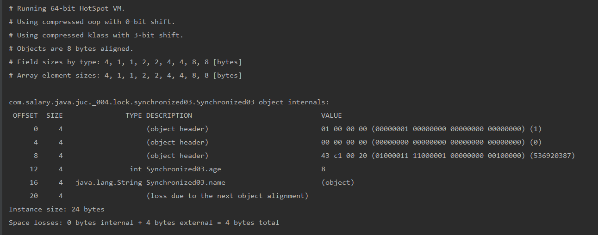
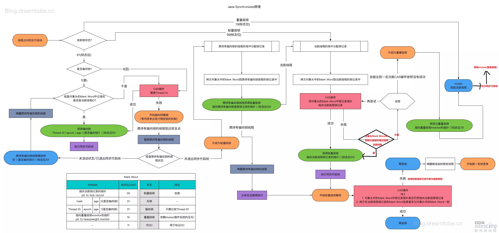

####对象布局介绍，markword介绍 
    https://blog.csdn.net/xueba8/article/details/88753443
    https://ddnd.cn/2019/03/22/java-synchronized-2/
    https://blog.csdn.net/shareus/article/details/51465252
    openjdk中 markWord.hpp 对于头部信息的描述  
    https://github.com/unofficial-openjdk/openjdk/blob/jdk/jdk/src/hotspot/share/oops/markWord.hpp
    https://www.jianshu.com/p/d48c9b0fc1b4
    https://juejin.im/post/5a701c246fb9a01cb8100489
    https://tech.meituan.com/2018/11/15/java-lock.html
    https://juejin.im/post/5e1d8723f265da3e0535ef0c
    https://github.com/farmerjohngit/myblog
    https://www.jianshu.com/p/f3bb5313fce4
    https://ifeve.com/java-synchronized/
    https://www.jianshu.com/p/282bdb57e343
    https://ifeve.com/jdk1-8-abstractqueuedsynchronizer/
    
    
    //  - the two lock bits are used to describe three states: locked/unlocked and monitor.
    //
    //    [ptr             | 00]  locked             ptr points to real header on stack
    //    [header      | 0 | 01]  unlocked           regular object header
    //    [ptr             | 10]  monitor            inflated lock (header is wapped out)
    //    [ptr             | 11]  marked             used to mark an object
##### 锁的状态

###### 无锁
   
  
###### 偏向锁-自旋锁
    自旋锁是指当一个线程尝试获取某个锁时，如果该锁已被其他线程占用，就一直循环检测锁是否被释放，而不是进入线程挂起或睡眠状态。
    自旋锁适用于锁保护的临界区很小的情况，临界区很小的话，锁占用的时间就很短。
###### 轻量级锁

###### 重量级锁

